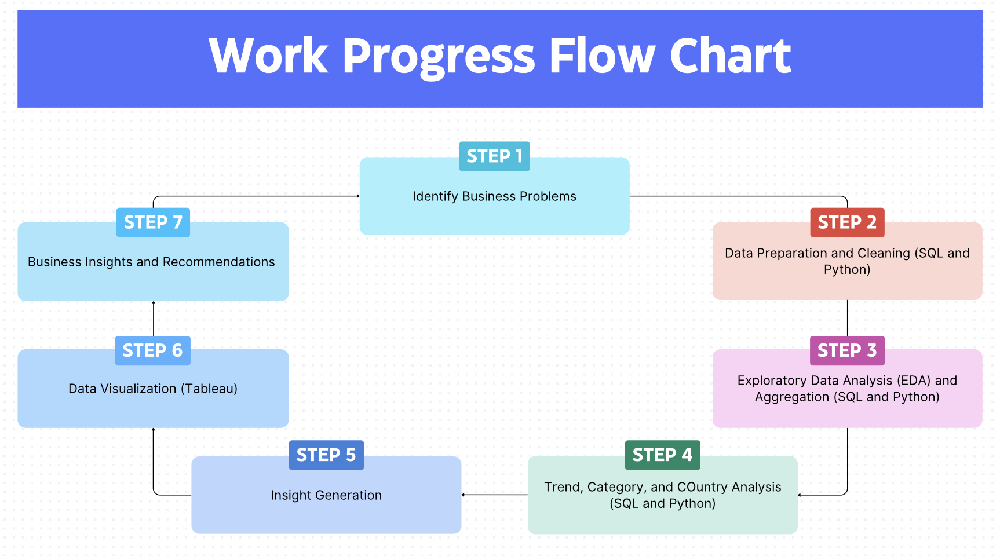
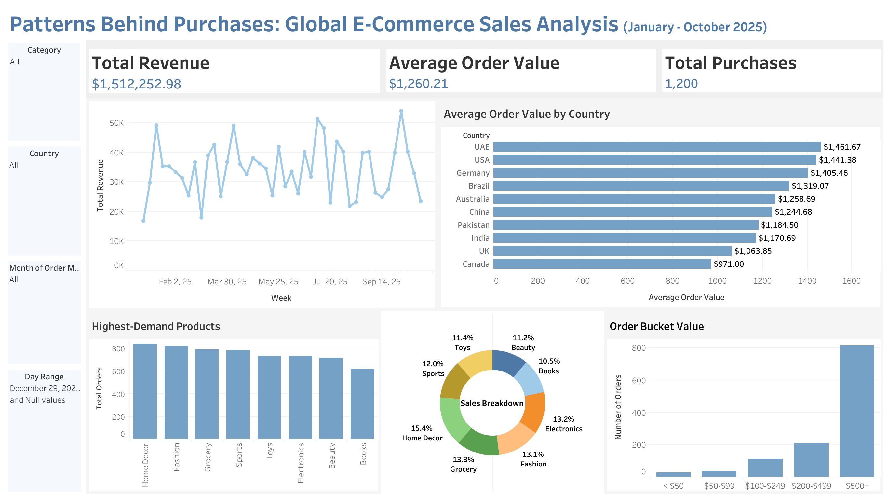

# Patterns Behind Purchases: End-to-End Analysis For Global E-Commerce 

## Executive Summary
This project analyzes sales transaction data using SQL and Tableau to identify key revenue drivers, seasonal demand patterns, and market-level differences across countries and product categories. By examining overall sales performance, unit economics, and country-specific purchasing behavior, particularly in high-population markets such as the United States, China, and India; the analysis uncovers where revenue is concentrated and how customer demand varies over time. The results are visualized through interactive Tableau dashboards, enabling stakeholders to quickly assess performance, evaluate risk, and make data-driven decisions related to pricing, inventory planning, and market strategy.

## Business Problem
The business faces lack of visibility into which markets, products, and time periods drive revenue, therefore, make it difficult to optimizing pricing, inventory, and market startegy. Differences in purchasing behavior across large-population markets such as United States, China, and India further complicate decision-making, while revenue concentration increases risk without insights

## Methodology
- Used **SQL and Python** to clean, aggregate, and analyze sales data, calculating core performance metrics (orders, revenue, average order value) and evaluating product, country, and unit-economic performance.
- Conduct **time-series and seasonal analysis** to identify monthly revenue trends and compare product demand across peak and off-peak periods.
- Visualized key inisghts in **Tableau** through interactive dashboards to support market comparison, trend analysis, and execute decision-making.
  

## Skills
- SQL: CTEs, CASE, WINDOWN FUNCTIONS, GROUP BY, AGGREGATE FUNCTIONS.
- PYTHON: pandas, matplotlib
- TABLEAU: writing functions, calculated columns, data modeling, data visualization.

## Result and Business Recommendations

**Results:**
The business generated $1.51M in revenue with a high average order value ($1,260), driven mainly by a small set of countries, including USA, UAE, Germany, Brazil, and India. Demand is strongest in categories such as Home Decor and Fashion, indicating revenue is primarily dominated by large purchases. Revenue maintains relatively stable throughout the year with mid-year peaks during July, followed by a noticeable decline toward the final month.

**Business Recommendations:**
Should focus on high-performing countries with localized product and marketing strategies, and strengthen premium bundles and loyalty programs to maintain on high-value orders. Align inventory and promotion with mid-year demand peaks, and further deep dive into the late-year revenue drop to improve forecating and planning.
